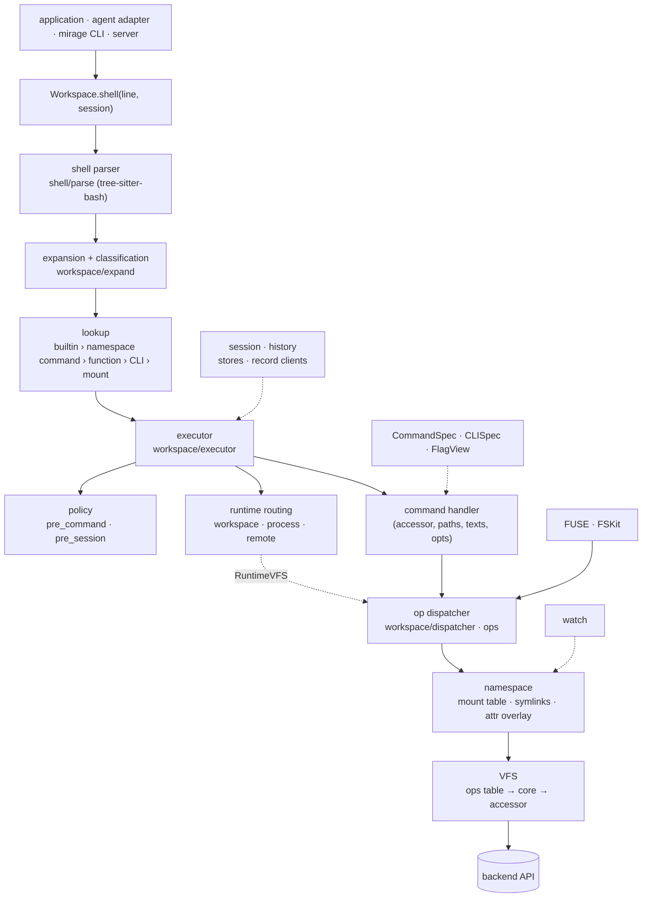
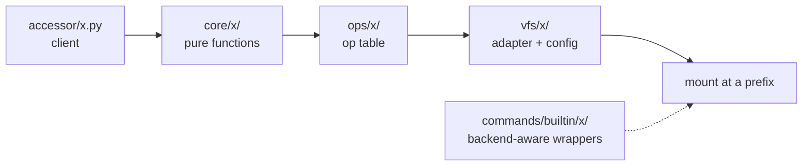

# CLAUDE.md

MIRAGE is a virtual terminal for AI agents: a bash-compatible shell over one
virtual filesystem that mounts anything (object stores, SaaS, databases,
disk) at a prefix. It is the control plane between an agent and its data:
every backend is reached through one async-native op dispatcher, with an
index, a read-through cache and per-mount policy in the path, so a listing
costs one request and a refused action never reaches the service. It is
implemented in Python and in TypeScript with the same layout and the same
semantics.

## Development

### Commands

- Python lives in `python/` (`mirage/`, `tests/`). Setup:
  `cd python && uv sync --all-extras --no-extra camel`. Add dependencies with
  `uv add`. Test: `uv run pytest`.
- TypeScript lives in `typescript/` (`packages/core`, `node`, `browser`,
  `cli`, `server`, `agents`, `dsh`, `opencode`): `pnpm install`,
  `pnpm build`, `pnpm typecheck`, `pnpm test`. Rebuild the dists after a
  merge; integ and the examples import them.
- Lint everything: `./python/.venv/bin/pre-commit run --all-files` from the
  repo root (the venv binary, so `examples/` is included).
- Examples run from the repo root with the venv interpreter:
  `./python/.venv/bin/python examples/python/s3/s3.py`.
- **Do not add a changeset.** `typescript/.changeset/` stays as it is for
  now: the public interface is still moving, so a per-PR version note
  describes a surface that changes again before it ships. Nothing gates on
  one. The release notes get written once the interface settles.

### Gates

- `scripts/check_layout_parity.py --strict`: module sets of `mirage/<pkg>/`
  against the TypeScript twin; the count must equal the committed baseline.
  Exceptions live in `spec/layout_exceptions.json` with a reason.
- `scripts/gen_specs.py` and `typescript/scripts/gen-specs.ts` regenerate
  `spec/`; `scripts/check_spec_parity.py` diffs command specs, VFS registries
  and config fields across the two languages.
- `scripts/check_barrel_surface.py`: every `core` export has a consumer.
- `integ/`: one JSON case corpus runs on both hosts against the same targets
  and goldens. Any change in observable shell behavior adds a case.

### Patterns

Modules split by role, the same in both languages: `types.py` (shapes
only), `errors.py`, `config.py` (knobs; fail loud on unknown fields),
`constants.py`, `mixin.py` (stateless capability mixins, detected with
`isinstance`), `base.py` (the ABC and nothing else).

- Keep Python and TypeScript mirrored. Change both sides; the more correct
  side wins.
- Async-native (`aiofiles`, `redis.asyncio`, `aioboto3`). Never call
  `asyncio.run()` where a loop may already be running.
- Imports at the top of the file. A cycle means the dependency direction is
  wrong; fix the design.
- Never swallow an exception. Log it with `logger.debug` or let it
  propagate.
- Never annotate as `object`. Use `FlagValue`, `JsonValue`, `str | PathSpec`,
  `Accessor`, `IndexCacheStore | None`, `StatFn`, or a one-member `Enum` for a
  sentinel.
- A path is a `PathSpec` wherever possible, never a raw string.
- A nested function must close over its enclosing scope; otherwise it goes to
  module level.
- Tests mirror `mirage/` 1:1, with no `__init__.py` under `tests/`. Patch a
  backend command through `cmd.__wrapped__.__globals__`.
- Docstrings type their Args. No comment at the top of a file, no per-line
  comments, few prints. Do not rename files or add READMEs unless asked. No
  backward compatibility.
- `FileStat.size` is the rendered byte length or `None`, never a
  storage-side number.

### User-exposed surfaces

Change these deliberately, in both languages, with a golden or gate in the
same PR.

- **Shell commands** follow POSIX and GNU coreutils. Pin GNU with docker
  (`debian:stable-slim`) before changing semantics and document a divergence
  where it lives. Exit codes and stderr wording are part of the contract.
- **`CommandSpec`, `Operand`, `Option`** are shared by every command. Add a
  field only when POSIX and argparse both already have the concept, named
  after theirs. `CLISpec` is a `CommandSpec`, so it gets no exemption.
- **CLIs (`CLISpec`)** are the agent's tools, dispatched by name. An account
  CLI declares a `config_model` and consults no mount; `git` declares none
  and reads its repository through `CLIDoors`. `register_cli` is host-side
  only; there is no install builtin. A CLI that mimics a real program is
  gated against that program (`integ/ntn_conformance.ts`).
- **Mount configs** are one snake_case block with one door per language,
  `build_vfs` and `buildVfs` (`parseConfigWithSchema`). Field sets are gated
  by `spec/*/vfs.json` and `integ/config/`.
- **YAML keys**, the `mirage` CLI output, the server API and the agent
  adapters are public. A TypeScript API change gets a changeset.
- **Handlers** take `(accessor, paths, texts, opts)`. Read flags through a
  spec-bound `FlagView`, never raw. Generics own flag interpretation and parse
  once into a frozen struct; backend wrappers are wiring only.

## Design

### Workspace

`Workspace` (`workspace/workspace/`) holds mounts (`{prefix: VFS | Mount}`),
sessions, runtimes, policy and the op dispatcher. It executes a line,
registers CLIs and snapshots state. `Mount` adds `MountMode` and
`MountBackend` (`workspace | fuse | fskit`; `workspace` means inside mirage
only).

### VFS

One backend adapter per prefix (`vfs/`, `BaseVFS`, `GenericVFS`): object
stores, SaaS, databases, disk, RAM. Each backend is four layers with one
name: `accessor/x.py` (client), `core/x/` (pure functions), `ops/x/` (op
table), `vfs/x/` (adapter and config model). `vfs/registry.py`
(`known_vfs_names`, `build_vfs`) and the entry-point group `mirage.vfs` are
the registry. A VFS never stores a symlink, reports leaf files only, and
classifies an entry through `stat`, never by name.

### POSIX layer

What the agent sees over every VFS. Ops (`ops/`, `OpsRegistry`) are the
syscall-shaped table a mount answers: `read`, `write`, `append`, `stat`,
`readdir`, `mkdir`, `rmdir`, `unlink`, `rename`, `truncate`; the dispatcher
(`workspace/dispatcher/`) resolves a virtual path to a mount and calls them.
Commands (`commands/builtin/`) are the coreutils: a generic implements a
family once (`generic/`), `generic_bind/` binds it to a backend,
`crossmount/` and `executor/fanout.py` handle a line that spans mounts. The
namespace (`workspace/mount/namespace/`) sits above every backend with the
mount table, symlinks and the attribute overlay; `MountView` and `LinkView`
ride `CommandOpts` (`opts.ns`) into every handler. A `filetype` registration
on a mount is the only renderer extension point.

Pinned behavior: `find -size` rounds up and the start row is the generic's;
`du` derives directory rows, sorts siblings, counts bytes and exits 1 on a
usage error; `tar` and `zip` plan on one traversal (`scan_operand`) and never
cross a descendant mount; `MountRootPolicy` answers EBUSY for a mount root
under `rm`/`mv`/`mkdir`/... and refuses it as a source of `tar -c`, `zip`,
`cp`.

### Shell

`shell/parse/` (tree-sitter-bash) builds the node tree `workspace/node/`
runs; `workspace/expand/` expands and classifies words; `workspace/lookup/`
holds the one precedence list (builtin, namespace command, function, CLI,
mount); `workspace/executor/` runs pipes, redirects, jobs and control flow.
Follow tables live in `workspace/names.py`. Every session write goes through
`SessionView.set`, so a `pre_session` rule is enforced; only shell
bookkeeping and `seed_var` are exempt.

### CommandSpec

`commands/spec/`: the argparse-shaped grammar, `parse_command`,
`compile_spec`, `FlagView`, help, usage and GNU option prefixes.
`UsageStyle` (`ARGPARSE`, `GIT`, `CLAP`) on the root spec sets help layout,
refusal wording and exit code. `operand_base` (tar `-C`) is resolved by the
parser, before classification.

### CLISpec

`commands/cli/`: a typed program tree bound to a head word. One
`CLIInvocation` per leaf; `inv.doors` (`dispatch`, `stat_path`, `ns`,
`session_view`) is the only way to a mount. `man`, `--help`, `type -t` and
`which` derive from the spec. `ntn` is the worked example (CLAP voice, a
serde_json-faithful scanner, exit 1 for a bad body and 5 for a bad line).

### Sessions, policy, history

`workspace/session/`: env, cwd, functions, jobs; stores for RAM, disk,
redis, s3. `policy/`: `pre_command`, `pre_session`, profiles and scripts;
builtins `mount_root`, `output_cap`, `permissions`. `observe/`: a hidden
`Observer` records every top-level command; `/.bash_history` and the
`history` builtin are two views of that one recording.

### Runtimes

`runtime/`: `Runtime`, `RuntimeConfig`, `EvaluatorMixin`, reach
`workspace | process | remote`. `WorkspaceRuntime` (default) runs inside
mirage; `MontyRuntime` and wasm run in-process; `SSHRuntime` and
`DaytonaRuntime` run remote. `RuntimeVFS` bridges a guest's file ops back to
the dispatcher.

### FUSE and FSKit

`fuse/` (python) and `node/src/fuse/`: `MountCore` owns the semantics,
`MirageFS` is the libfuse adapter, `classify_error` is the one errno table.
`direct_io` plus `attr_timeout=0` keep unknown sizes correct. Python fskit
writes need `fuse/darwin.py`. One FUSE mount per process on macOS. Never
touch your own TypeScript mountpoint synchronously.

### Records, cache, watch, spec, integ

`workspace/record/`: keyed-record clients (disk lockfile plus rename, s3
CAS) that sessions, the node table and metadata import, never the reverse.
`cache/`: the read-through file cache and the index a readdir fills.
`watch/`: external changes as mount events. `spec/`: generated specs per
host. `integ/`: runners, fake services (`server/`), goldens (`truth/`),
`targets.json`; spawn asynchronously, a fake on the same loop deadlocks a
sync spawn.

## Architecture



One backend, bottom to top:



Repository:

```
python/mirage/   accessor core ops vfs commands workspace shell runtime policy
                 observe cache watch fuse cli server agents
typescript/packages/
  core/          runtime-agnostic twin; no Node-only or browser-only API
  node/ browser/ runtime-specific VFS, commands, wiring, FUSE (node)
  cli/ server/ agents/ dsh/ opencode/
spec/ integ/ docs/ examples/ scripts/
```
