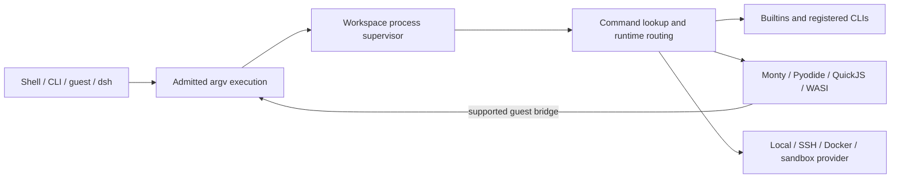

<div className="my-6">
  
  
</div>

Mirage stacks four thin layers between an agent and the services it touches.

## 1. AI Agent and Application

The agent (or any application embedding Mirage) issues bash commands, VFS calls, or syscalls. One vocabulary, every backend.

## 2. Mirage Bash and VFS

The action surface. **Mirage Bash** parses commands with tree-sitter and runs them against the **Mirage VFS**, a unified filesystem API over every mount. A **FUSE Adapter** exposes the same tree to host tools when you want it. A **Command Registry** and **VFS Registry** describe what verbs and mounts are available.

## 3. Dispatcher & Cache

The **Mirage Dispatcher** routes each operation to the mount that owns the path, joining pipelines that span systems. The **Index & File Cache** absorbs repeats: the first directory walk hits the API, the next serves from cache; the first read streams bytes, later reads are local.

Mount mode and session grants govern every mutation at the operation dispatcher,
including symlinks, permissions and extended attributes stored in the namespace.
Write admission precedes backend initialization and capability lookup. A read-only
mount therefore returns a read-only refusal even when its backend has no handler
for that operation. Backend capabilities describe what an admitted operation can do;
they do not grant permission.

Shell actions use these same operations: `>>` dispatches `append`, and `find -delete`
dispatches `unlink` or `rmdir`. Any append emulation runs below admission, so a refused
append never fetches file contents. The dispatcher also owns cache invalidation and
namespace cleanup after mutations.

File sizes describe rendered bytes. An unknown size remains unknown: `find -empty`
requires a confirmed zero-length regular file or a directory with no entries. It does
not fetch a rendered file merely to determine its size. This differs from GNU's local
filesystem view, where a regular file's size is available from `stat`.

## 4. Infrastructure and Remote

Whatever you mount: RAM, Disk, Redis, S3 / R2 / GCS / OCI / Supabase, Gmail / GDrive / GDocs / GSheets / GSlides, GitHub / Linear / Notion / Trello, Slack / Discord / Email, MongoDB / Postgres / LanceDB / Qdrant, SSH, and more. Each speaks the same filesystem semantics from the agent's point of view.

Browse the [VFS Matrix](/home/vfs-matrix) for the full list.

## Where to go next

- [VFS Matrix](/home/vfs-matrix) to pick a backend to mount.
- [Python Quickstart](/python/quickstart) for working code in minutes.
- [TypeScript Quickstart](/typescript/quickstart) for the same Workspace API in Node, browser, or edge.

## Managed execution

The workspace also owns a process supervisor. Shell lines, background jobs, pipeline stages, subshells and
`Workspace.spawn` share this inventory. A process is an asynchronous Mirage
execution; its PID is workspace-local and is never a native worker PID. Native
runtimes still execute in the environment described by their `reach` guarantee.

`spawn` accepts literal argv, opens bounded asynchronous byte pipes, and returns
an immediate handle. Arguments enter the same command lookup, admission and
runtime routing as shell commands. For example, `['printf', '%s', '$(whoami)']`
prints the literal operand. To interpret a script, explicitly spawn
`['sh', '-c', script]`. Command and CLI handlers receive the same scoped spawn
door on `opts.processes` and `inv.doors.processes`; runtime contexts carry it too.



Use `communicate(input)` to send input and drain both output pipes concurrently.
Calling `wait` without consuming a piped output can apply backpressure, just as
with a native pipe. Termination requests cancellation; the process remains
`stopping` until its runner settles. Parent cancellation
reaches its live managed children. Workspace shutdown awaits tracked runners before closing their mounts;
a runner that ignores cancellation keeps shutdown pending. Metadata includes
parent and execution-group IDs. A provider's native descendants are not inferred from these IDs.

The shell keeps its job table separately: `%1` is local to a session, while `$!`
and `jobs -p` return the managed PID. `wait PID` resolves a child job and numeric
`kill PID` can reach an authorized managed runner even after `disown` removed
its job entry. `ps`, `ps aux`, `ps -e` and `ps -ef` list visible live runners,
including foreground work. Their deliberately compact format is `PID<TAB>COMMAND`:
Mirage has no CPU, RSS, TTY or native process-tree accounting to populate GNU's
columns. Subshells keep private job tables while sharing the workspace process supervisor.
`$$` is the session's virtual shell identity, inherited by shell forks; an idle
shell is not a live runner in `ps`. Signals, stopped jobs and native process
groups are not emulated. Existing shell cancellation retains exit status 137;
the Debian bash reference reports 143 for its default SIGTERM.

Profiles grant views rather than owning processes:

```yaml
profiles:
  reviewer:
    processes:
      metadata: session
      details: none
      control: none
      spawn: true
```

`metadata`, `details` and `control` each accept `none`, `session` or `workspace`.
Defaults are `session`; spawn defaults to true and still passes command
admission. `details: none` redacts command text, cwd and failure details; `jobs`,
`fg` and `ps` print `[hidden]` in its place. `metadata: none` hides the session's
own jobs from `jobs`, `fg`, `disown`, `kill %N` and `wait` with operands; a bare
`wait` still joins them, since it names none. Control also requires metadata
visibility. A spawned child's output is its handle's result, so the command limits
bound it as they bound a typed line's, wherever the parent's own output goes. Inline permissions only narrow these grants.
Two sessions using the same profile do not thereby share their processes.
Replacing a profile revokes captured doors and requests cancellation of that
session's executions; closing the session also cancels its managed work.
Output remains owned by the returned child handle or shell job console: metadata
access does not grant another process's output stream or replay. Only live
processes appear in the supervisor; retain a handle to inspect its final result.

For a workspace backed by stored sessions, hydrate with `ensure_sessions_loaded`
(Python) or `ensureSessionsLoaded` (TypeScript) before spawning. A session replaced
by hydration fails a pending spawn instead of executing with stale permissions.

| Runtime or entry point | Managed execution | Guest child execution |
| --- | --- | --- |
| Builtins, commands, registered CLIs | Shared supervisor and admission | Scoped process door for handlers |
| Monty, both SDKs | Managed worker execution | No subprocess module; import fails normally |
| Pyodide, TypeScript | Managed execution | `subprocess.Popen` and standard helpers in a shared-memory worker |
| QuickJS and WASI | Managed execution | No subprocess ABI supplied by Mirage |
| Local Python and process runtimes | Tracks the admitted invocation | Native subprocess APIs retain native reach and bypass the guest bridge |
| SSH, Docker, E2B, Daytona, SmolVM, Sandlock | Existing runtime routing, where that SDK provides the adapter | Native provider behavior; no generic descendant-control guarantee |
| dsh `ctx.subprocess` | Shared argv, pipes, collection and managed-range wait | Workspace-only runtimes; PTYs and native/remote worlds refused |

Nested Monty and Pyodide calls use independent execution capacity and have a
maximum nesting depth of 16. A parent never waits for a child queued behind its
own interpreter. Pyodide blocks only its worker for the synchronous Python API;
the host answers asynchronously. Guest mutations flush before spawning and guest
file caches invalidate afterward. A host without shared-memory worker support
gets an explicit unsupported error. Pyodide supplies `Popen`, so standard `run`,
`call` and `check_output` remain ordinary Python code. Live pipes, polling, waits,
communication, timeout retry, `shell=True`, merged stderr, and text conversion
use the supervisor. An explicit Python `env` replaces the inherited environment.
Program lookup uses the profile-visible executable view; shell functions and
shell-only builtins do not participate. Host `spawn` retains environment overlay
by default and exposes `replace_env` / `replaceEnv` for adapters.

Unfinished Pyodide children are cancelled and joined when their guest invocation
ends. Stdin inheritance transfers buffered unread input, not a shared kernel
descriptor. Native descriptor passing, PTYs, signal handlers, and Python's
`asyncio` subprocess transport are not implemented. TERM and KILL both request
managed cancellation; their negative return codes identify the request, not a
native OS signal delivery. Provider adapters may buffer their output;
the byte-pipe API does not turn a buffered provider into an incremental one.
