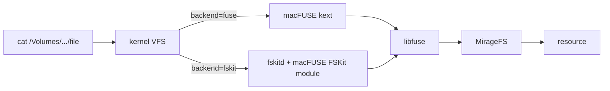

## Prerequisites

- Python 3.11+
- [uv](https://docs.astral.sh/uv/) package manager (optional)

## System FUSE

Install the OS-level FUSE driver first (see the
[support matrix](/home/setup/fuse) for the full OS overview):

- [macOS FUSE Setup](/home/setup/macos), macFUSE + kernel extension + Apple Silicon recovery mode steps.
- [Linux FUSE Setup](/home/setup/linux), `fuse3` install and `/etc/fuse.conf`.
- [Windows FUSE Setup](/home/setup/windows), WinFsp install; experimental.

## Install Mirage with the FUSE Extra

```bash
pip install "mirage-ai[fuse]"
```

Or with uv:

```bash
uv add "mirage-ai[fuse]"
```

## Verify

```python
from mirage import Mount, MountBackend, MountMode, Workspace
from mirage.resource.ram import RAMResource

with Workspace(
    {"/data": Mount(RAMResource(), mode=MountMode.WRITE,
                    backend=MountBackend.FUSE)}) as ws:
    print("mountpoints:", ws.fuse_mountpoints)
```

If the printed path exists under `/tmp/mirage-*`, FUSE is wired up correctly.

The `Workspace` constructor blocks until every kernel mount is live, so the
mountpoint is ready to read as soon as the `with` block is entered, no sleep
needed. (In TypeScript, where mounts are async, you `await ws.fuseReady()`
instead.)

## Per-mount backends

How a mount is exposed is configured **per mount**, through one `backend`
field:

| `backend` | Effect |
| --- | --- |
| `vfs` (default) | Lives only inside mirage's own filesystem, reached through the command surface. Nothing is registered with the kernel. |
| `fuse` | Also exposed as a real mountpoint via FUSE. |
| `fskit` | Also exposed as a real mountpoint via FSKit, with no kernel extension. macOS 15.4+ only; see below. |

A kernel-backed mount shows only that mount's subtree. `mountpoint` pins
where it lands; omit it for a fresh temp directory:

```yaml
mode: WRITE
mounts:
  /data:
    resource: ram
    backend: fuse
    mountpoint: /tmp/data-repo   # explicit path
  /s3:
    resource: s3
    backend: MountBackend.FUSE             # temp directory
  /logs:
    resource: disk
    # no backend key: stays on the vfs default, not kernel-mounted
```

`ws.fuse_mountpoints` returns a `{prefix: path}` map of the live mountpoints.

## Mounting without the kernel extension (FSKit)

Apple has deprecated third-party kernel extensions: on Apple Silicon the
macFUSE kext already needs a reduced-security boot plus admin approval, and
future macOS releases are expected to stop loading it entirely. FSKit
(macOS 15.4+) is Apple's supported userspace replacement, and macFUSE 5.x
serves the same libfuse API through it. `backend=fskit` is mirage's path to
keep real mounts working on Macs where the kext is blocked. Only the
kernel-to-userspace hop changes:



Set `backend` on the mount:

```python
from mirage import Mount, MountBackend, MountMode, Workspace
from mirage.resource.ram import RAMResource

with Workspace({
    "/data/": Mount(RAMResource(), mode=MountMode.WRITE,
                    backend=MountBackend.FSKIT)
}) as ws:
    print(ws.fuse_mountpoint)   # /Volumes/mirage-...
```

`kextstat` stays empty and the mount table tags the volume `fskit`. Two rules
are enforced at mount time rather than discovered at run time:

- **The mountpoint must be under `/Volumes`.** FSKit refuses anything else.
  Mirage names one automatically when you do not pass a path, and rejects an
  explicit path outside it.
- **Mirage does not create the mountpoint, macOS does.** An FSKit mount is a
  volume: the `/Volumes` entry appears when the filesystem goes live and is
  removed when it unmounts. `/Volumes` is root-owned, so nothing here needs
  (or could get) elevated permissions.
- **Every mounted resource must be able to size its files.** See below.

There is deliberately **no `auto`** value: auto-selecting FSKit would silently
break every API-backed mount, and an option whose safe value is always the
default is a trap. `MountBackend.FSKIT` is macOS-only and raises elsewhere.

The metadata write surface works: create, mkdir, rename, unlink and
in-place overwrites, pinned by `integ/fuse/truth_fskit.json`. This depends
on `mirage/fuse/darwin.py`, which declares macFUSE's Darwin-only callbacks
(`setattr_x`, `renamex`) that the FSKit shim uses to finalize new items and
route renames; stock mfusepy leaves those slots NULL, which fails every
create with ENOSYS after the file already landed.

<Warning>
  **Data writes are unreliable: treat fskit mounts as read-mostly.** The
  macFUSE FSKit shim flushes pages a file did not already have (a new file,
  an empty file, a truncate-then-write, so anything `cp` or `>` does) as
  NUL bytes of the right length, and appends arrive intact or zeroed
  depending on cache state. The writer sees no error, and reading back
  through the mount shows the written data (the kernel serves its own page
  cache), so the corruption is invisible until the backing store is read
  directly. Mirage warns at mount time when an fskit mount accepts writes
  (`check_writes`); mount read-only, or use `MountBackend.FUSE` for
  anything that writes file data. Pinned in `integ/fuse/truth_fskit.json`,
  so a macFUSE release that fixes the shim flips the pin loudly.
</Warning>

<Warning>
  **Two more upstream FSKit-shim caveats** (macFUSE 5.3.3):
  [#1181](https://github.com/macfuse/macfuse/issues/1181), running a binary
  off an fskit mount fails until the file has been read once; and
  [#1165](https://github.com/macfuse/macfuse/issues/1165), new entries in
  the volume root may not appear in a live mount because the root readdir
  cache cannot be invalidated.
</Warning>

<Warning>
  **FSKit cannot serve size-unknown resources.** There is no `direct_io`, so
  reads are driven entirely by the size `stat` reports; a resource that
  stats 0 pre-open returns empty files with exit code 0. Mirage warns at
  mount time, naming the degraded mounts (`SIZES_ALWAYS_KNOWN`), and lets
  the mount proceed. Byte stores (ram, disk, redis, s3, gridfs) qualify,
  and Linear qualifies through size push-down (sizes computed from the
  listing payloads a readdir already fetched); other API-backed resources
  need `MountBackend.FUSE`, or scope the fskit mount to a sized subtree.
</Warning>

`examples/python/fuse/fskit.py` runs all of this end to end: the size guard
warning about a resource that cannot size its files, a live mount with reads
matching their stat size, and each write op with its result, including the
shim's NUL-byte flush.

TypeScript supports the same backend with the same guards
([details](/typescript/setup/fuse#mounting-without-the-kernel-extension-fskit));
`examples/typescript/fuse/fskit.ts` is its live end-to-end check.

## Size semantics for API-backed files

Some resources (Linear, Trello, Slack, ...) cannot report a file's size
without fetching its content, so `stat` returns an unknown size. Over the
FUSE mount these files behave like Linux `/proc` files: they stat as **0
bytes until first open**, and become fully readable the moment anything opens
them. Mirage mounts with `direct_io` (the kernel reads to EOF regardless of
the reported size) and `attr_timeout=0` (post-open `fstat` returns the real
size of the now-fetched content, kept warm in a 30-second cache).

What that means per tool:

| Tools | Behavior |
| --- | --- |
| `cat`, `grep`, `head`, `cp`, `md5sum`, `sed`, `sort` | correct content, always |
| `wc -c`, `tail -c` | correct (they fstat after open, which serves the real size) |
| `ls -l`, `du`, `find -size`, `test -s` | report 0 until the file has been opened recently |
| `tar`, `rsync`, `scp` | see 0 at stat time and copy empty content, exactly like `tar` over `/proc`; read the file first or use `cat`/`cp` based flows |

Mirage never reports a fake size and never fetches content during `stat`:
returning real sizes eagerly would fire one API call per file on every
`ls -l`.

<Note>
  **Windows differs**: it cannot query attributes without opening a handle,
  so a per-file `stat` of a size-unknown file fetches the content and shows
  the real size immediately. Directory listings stay cheap. See
  [Windows FUSE Setup](/home/setup/windows) for the other Windows-specific
  behaviors (unmount at process exit, mount-level ownership).
</Note>

<Warning>
  **macOS allows only one in-process FUSE mount.** macFUSE registers a
  process-global signal source, so a second simultaneous mount in the same
  process fails with `fuse: cannot register signal source`. Multiple per-mount
  FUSE mounts work on Linux and Windows; on macOS, use a kernel backend on a single
  mount per workspace (or run additional mounts in separate processes).
</Warning>

## Symlinks and Permissions

Symlinks live in Mirage's namespace, not in any backend. Links created with
`ln -s` in the Mirage shell (or with `ln -s` inside the mountpoint) appear as
real symlinks over FUSE: `ls -l` shows `lrwxrwxrwx`, `readlink` prints the
target, and reads follow the link. Absolute targets are displayed relative to
the link's directory so they always resolve inside the mountpoint.

Permission bits shown over FUSE come from Mirage's metadata (`chmod`,
`chown`, `touch` results), and they are **display only**: access control is
enforced by Mirage mount modes, not by the kernel. For that reason, never
mount with the `default_permissions` FUSE option. It would make the kernel
enforce the displayed bits, and a `chmod 000` could lock Mirage out of its
own files.
