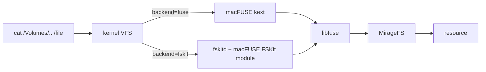

## Prerequisites

- Node.js 20+
- [pnpm](https://pnpm.io/) (recommended, `npm` and `yarn` also work, but the FUSE binding's install script needs extra configuration with pnpm).

## System FUSE

Install the OS-level FUSE kernel support first (see the
[support matrix](/home/setup/fuse) for the full OS overview):

- [macOS FUSE Setup](/home/setup/macos), macFUSE + kernel extension + Apple Silicon recovery mode steps.
- [Linux FUSE Setup](/home/setup/linux), `fuse3` install and `/etc/fuse.conf`.

<Note>
  **No Windows support in TypeScript.** `@zkochan/fuse-native` targets macOS
  and Linux only; its legacy Windows path builds against the unmaintained
  Dokany-based `fuse-shared-library-win32`, not WinFsp. Python's FUSE mounts
  run on Windows experimentally, see [Windows FUSE Setup](/home/setup/windows).
</Note>

## Install the Node Binding

The Node package (`@struktoai/mirage-node`) ships FUSE support via an **optional peer dependency** on [`@zkochan/fuse-native`](https://www.npmjs.com/package/@zkochan/fuse-native), the pnpm author's actively-maintained fork that works on Node 20+ and supports both macOS and Linux (thanks to [@zkochan](https://github.com/fuse-friends/fuse-native/issues/36#issuecomment-3089754579)).

```bash
pnpm add @struktoai/mirage-node @zkochan/fuse-native
```

<Tip>
  Non-FUSE users don't need `@zkochan/fuse-native`, the base `@struktoai/mirage-node` package works without it. Only install the binding when you want a real mountpoint.
</Tip>

### Allow pnpm to run the install script

`@zkochan/fuse-native` compiles native code on install. pnpm blocks install scripts by default, allow this one explicitly in `pnpm-workspace.yaml`:

```yaml
onlyBuiltDependencies:
  - '@zkochan/fuse-native'
```

Or, if you're not using a pnpm workspace, in `package.json`:

```json
{
  "pnpm": {
    "onlyBuiltDependencies": ["@zkochan/fuse-native"]
  }
}
```

## macOS 4+ Symlink Workaround

<Tabs>
  <Tab title="macOS">
    macFUSE 4 ships `libfuse.2.dylib` instead of the legacy `libosxfuse.2.dylib` that `@zkochan/fuse-native` was built against. Create a one-time symlink:

    ```bash
    sudo ln -sf /usr/local/lib/libfuse.2.dylib /usr/local/lib/libosxfuse.2.dylib
    pnpm rebuild @zkochan/fuse-native
    ```
  </Tab>
  <Tab title="Linux">
    No workaround needed on Linux, `@zkochan/fuse-native` links against `libfuse3` directly.
  </Tab>
</Tabs>

## Verify

```ts
import { Mount, MountMode, RAMResource, Workspace } from '@struktoai/mirage-node'

const ws = new Workspace({
  '/data': new Mount(new RAMResource(), { mode: MountMode.WRITE, backend: MountBackend.FUSE }),
})
await ws.fuseReady()

await ws.execute('echo hello | tee /data/x.txt')
console.log('mountpoints:', ws.fuseMountpoints)

// Any tool (ls, cat, external subprocess) can now see x.txt under the mountpoint.
await ws.close() // auto-unmounts
```

If `ws.fuseMountpoints` prints a `/tmp/mirage-fuse-XXXXXX` path and no error is thrown, the binding is wired up correctly.

Mounts are async, so `await ws.fuseReady()` once after constructing the workspace; it resolves when every kernel mount is live (and rejects if one fails to mount). Until then `ws.fuseMountpoints` may be empty. (In Python, where mounts are synchronous, the constructor blocks until ready instead.)

## Per-mount backends

How a mount is exposed is configured **per mount**, through one `backend`
field:

| `backend` | Effect |
| --- | --- |
| `vfs` (default) | Lives only inside mirage's own filesystem, reached through the command surface. Nothing is registered with the kernel. |
| `fuse` | Also exposed as a real mountpoint via FUSE. |
| `fskit` | Also exposed as a real mountpoint via FSKit, with no kernel extension. macOS 15.4+ only; see below. |

A kernel-backed mount shows only that mount's subtree. `mountpoint` pins
where it lands; omit it for a fresh temp directory:

```yaml
mode: WRITE
mounts:
  /data:
    resource: ram
    backend: fuse
    mountpoint: /tmp/data-repo   # explicit path
  /s3:
    resource: s3
    backend: MountBackend.FUSE             # temp directory
```

Programmatically, set `backend` per mount: `{ '/data': new Mount(dataResource, { backend: MountBackend.FUSE, mountpoint: '/tmp/data-repo' }), '/s3': new Mount(s3Resource, { backend: MountBackend.FUSE }) }`.
`ws.fuseMountpoints` returns a `{ prefix: path }` map of the live mountpoints.

## Mounting without the kernel extension (FSKit)

Apple has deprecated third-party kernel extensions; FSKit (macOS 15.4+) is
the supported userspace replacement, and macFUSE 5.x serves the same libfuse
API through it. This works from TypeScript: `fuse.node` links
`/usr/local/lib/libfuse.2.dylib` by absolute path, so `backend: 'fskit'`
reaches the same macFUSE 5.x libfuse the Python package uses, keeping real
mounts working on Macs where the kext is blocked. Only the
kernel-to-userspace hop changes:



```ts
const ws = new Workspace({
  '/data': new Mount(dataResource, { backend: MountBackend.FSKIT }),
})
await ws.fuseReady()
ws.fuseMountpoints['/data'] // => /Volumes/mirage-<id>, tagged fskit
```

The same rules as Python apply, checked at mount time: macOS-only, the
mountpoint must be under `/Volumes` (named by mirage, created by the
system), and every mounted resource should report exact sizes
(`sizesAlwaysKnown`; the `checkSizes` guard warns about anything else by
name, and those files read as empty).

**TS fskit mounts are read-mostly**, twice over. First, the data-write
zeroing described on
[the Python page](/python/setup/fuse#mounting-without-the-kernel-extension-fskit)
lives in the macFUSE shim, so it applies to both languages: pages a file
did not already have flush to the store as NUL bytes, and `checkWrites`
warns at mount time when an fskit mount accepts writes. Second, TypeScript
cannot create new names at all: `create`, `mkdir` and `rename` return
ENOSYS, and a failed create can still apply. The FSKit shim finalizes new
items through macFUSE's Darwin-only `setattr_x`/`renamex` callbacks; Python
declares them at runtime (`mirage/fuse/darwin.py`), but
`@zkochan/fuse-native`'s compiled op table cannot gain new C callbacks from
JavaScript, so fixing this side needs a native-binding change.

<Warning>
  **A wedged FSKit mount blocks more than itself.** A TS mount is served by
  the mounting process's event loop, and in testing an FSKit mount
  intermittently hung on a write op even when probed from child processes.
  A dead FSKit volume blocks `mount`-table enumeration system-wide until
  the macFUSE FSKit extension process is killed. Prefer `backend: 'fuse'`
  for anything long-running or write-heavy; treat `fskit` from TypeScript
  as read-mostly and experimental. `examples/typescript/fuse/fskit.ts` is
  the live end-to-end check.
</Warning>

## Size semantics for API-backed files

Some resources (Linear, Trello, Slack, ...) cannot report a file's size
without fetching its content, so over the FUSE mount those files behave like
Linux `/proc` files: they stat as **0 bytes until first open** and become
fully readable the moment anything opens them. See
[Limitations → Size-unknown API files](/typescript/limitations#3-size-unknown-api-files-stat-as-0-bytes-until-first-open)
for the per-tool table and the mechanics (`direct_io` + `attr_timeout=0`).

<Note>
  FUSE on Node has two runtime constraints worth knowing: `fs-monkey` can't patch ESM `node:fs` imports, and synchronous access to your own mount from the mounting process deadlocks the event loop that serves it. See [TypeScript Limitations](/typescript/limitations) for details and workarounds.
</Note>

<Warning>
  **macOS allows only one in-process FUSE mount.** macFUSE registers a
  process-global signal source, so a second simultaneous mount in the same
  process fails. Multiple per-mount FUSE mounts work on Linux; on macOS, enable
  a kernel backend on a single mount per workspace (or run extra mounts in separate
  processes).
</Warning>

## Symlinks and Permissions

Symlinks live in Mirage's namespace, not in any backend. Links created with
`ln -s` in the Mirage shell (or with `ln -s` inside the mountpoint) appear as
real symlinks over FUSE: `ls -l` shows `lrwxrwxrwx`, `readlink` prints the
target, and reads follow the link. Absolute targets are displayed relative to
the link's directory so they always resolve inside the mountpoint.

Permission bits shown over FUSE come from Mirage's metadata (`chmod`,
`chown`, `touch` results), and they are **display only**: access control is
enforced by Mirage mount modes, not by the kernel. For that reason, never
mount with the `default_permissions` FUSE option. It would make the kernel
enforce the displayed bits, and a `chmod 000` could lock Mirage out of its
own files.
