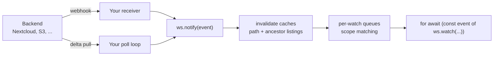

## What It Does

Files on a mounted backend change outside your workspace all the time: a
teammate uploads to Nextcloud, a pipeline rewrites an S3 object, or a cron job
deletes a report. `watch` turns those changes into an async event stream.

```ts
import { NextcloudResource, Workspace } from "@struktoai/mirage-node";

const resource = new NextcloudResource({ url: process.env.NEXTCLOUD_URL! });
const ws = new Workspace({ "/nc": resource });

for await (const event of ws.watch("/nc/Documents")) {
  console.log(event.kind, event.path.virtual);
  const result = await ws.execute(`cat ${event.path.virtual}`); // guaranteed fresh
  console.log(result.stdoutText);
}
```

No setup call is needed. The watch runtime attaches lazily on first use, and an
idle workspace carries no watch state. Mirage runs **no server and no
background loop**. Detection is yours—a webhook receiver or a small poll
loop—while Mirage handles cache invalidation, scope matching, and delivery.



## Scopes

The root's shape defines the depth, using GNU shell glob semantics. `*` never
crosses `/`, and matching happens at delivery time, so newly created files can
match.

| root                               | scope                                              |
| ---------------------------------- | -------------------------------------------------- |
| `/nc/data`                         | the whole subtree                                  |
| `/nc/data/*`                       | entries at that level only (shallow)               |
| `/nc/data/*/`                      | everything inside child directories                |
| `/nc/data/*.txt`                   | `.txt` entries at that level                       |
| `/nc/data/*/reports/`              | everything inside each child's `reports` directory |
| `['/nc/docs', '/nc/cfg/app.yaml']` | any of several roots, one event stream             |

```ts
for await (const event of ws.watch("/nc/data/*.pdf")) {
  // ...
}

for await (const event of ws.watch(["/nc/inbox/*", "/nc/config"])) {
  // ...
}
```

## The Event

```ts
class FileEvent {
  readonly kind: FileChangeKind; // create / update / delete / move / unknown
  readonly path: PathSpec;
  readonly timestamp: Date;
  readonly previousPath: PathSpec | null;
  readonly metadata: FileMetadata | null;
}
```

`FileMetadata` carries `fingerprint`, `size`, and `modified`. Producers fill
only what their signal honestly knows. A listing walk usually supplies all
three; a webhook payload may supply none.

Events are **level-triggered**: an event says what is dirty, not every
intermediate edit. Read current content through the workspace after receiving
one. Mirage invalidates the changed path and every cached ancestor listing up
to its mount root before the event reaches a subscriber.

`unknown` is the overflow signal. If a burst exceeds the queue cap, pending
events collapse into one `unknown` event per watch root, meaning “re-inventory
this subtree.” Precision degrades, but dirtiness is not lost.

## Push Mode

Map a provider webhook or queue message to a `FileEvent`, then inject it with
`ws.notify`:

```ts
import { FileChangeKind, FileEvent, PathSpec } from "@struktoai/mirage-node";

await ws.notify(
  new FileEvent({
    kind: FileChangeKind.CREATE,
    path: PathSpec.fromStrPath("/nc/data/report.txt"),
    timestamp: new Date(),
  }),
);
```

The provider receiver stays in your application, so it can use your existing
HTTP framework, authentication, retries, and deployment model.

## Pull Mode

Backends that implement `deltaHook()` answer one question: what changed under
this root since the last checkpoint? Nextcloud ships this capability today. A
baseline pull (`checkpoint === null`) establishes state and emits no changes.

```ts
import { PathSpec } from "@struktoai/mirage-node";

const mount = ws.registry.mountFor("/nc");
if (mount === null || mount.resource.deltaHook === undefined) {
  throw new Error("mount does not support pull detection");
}

const hook = mount.resource.deltaHook();
const root = PathSpec.fromStrPath("/nc", "");
let checkpoint: string | null = null;

for (;;) {
  const delta = await hook.pull(root, checkpoint);
  checkpoint = delta.checkpoint;
  for (const event of delta.changes) await ws.notify(event);
  await new Promise((resolve) => setTimeout(resolve, 30_000));
}
```

Pull is self-healing because current backend state is compared with the saved
checkpoint. Events missed while your service was down appear on the next pull.
A common production shape is push-first with a startup pull for recovery, or a
webhook used only as a doorbell that triggers one pull.

## Queues

Each `watch()` owns its own queue. `notify` fans an event out to every matching
queue, so overlapping watches consume independently and a slow consumer only
overflows its own queue.

The default `RAMWatchQueue` keeps one pending change per path. Create followed
by update stays create; create followed by delete cancels; delete followed by
create becomes update. Overflow policy is `collapse` (default), `drop_oldest`,
or `error`.

Attach a custom runtime before the first `watch()` or `notify()` call:

```ts
import { RAMWatchQueue, Watcher } from "@struktoai/mirage-node";

ws.attachWatchRuntime(
  new Watcher(
    ws.registry,
    (roots) => new RAMWatchQueue(roots, { maxPending: 64 }),
  ),
);
```

Any object satisfying `WatchQueue` (`push`, `pop`, `pending`, `clear`, and
`close`) can replace the RAM queue. This is the extension point for a durable
Redis, SQS, or database-backed queue.

Call `await ws.detachWatchRuntime()` to close subscriber queues and end active
watch loops cleanly without closing the workspace. The next `watch()` or
`notify()` lazily creates a fresh default runtime.

## Scope Notes

- Watch roots are fixed at subscription time. Start a new `watch()` to change
  the scope.
- One watch may span mounts, including nested mounts. Each event is invalidated
  on the longest-prefix mount that owns its path.
- Delivery works on every backend. Nextcloud is currently the first backend
  with a shipped `deltaHook()`; see the [Watch Matrix](/typescript/watch-matrix).
- Events are in-memory and at-most-once per subscriber unless you provide a
  durable queue implementation.
