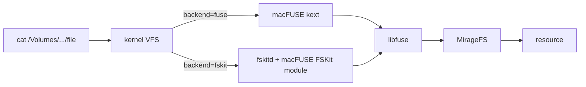

# Python examples

Runnable scripts, one directory per backend or topic. Run them from the repo
root with the venv interpreter so `.env.development` resolves:

```bash
./python/.venv/bin/python examples/python/s3/s3.py
```

Naming: `<backend>.py` uses the command surface, `<backend>_fuse.py` adds a
kernel mount, `<backend>_vfs.py` stays fully virtual.

## Mount backends: fuse vs fskit

Apple has deprecated third-party kernel extensions; on Apple Silicon the
macFUSE kext already needs a reduced-security boot and admin approval, and
future macOS releases are expected to stop loading it entirely. FSKit
(macOS 15.4+) is Apple's supported userspace replacement, and macFUSE 5.x
can serve the same libfuse API through it. `backend=fskit` is mirage's path
to keep real mounts working on Macs where the kext is blocked.



Same upper half either way; only the kernel-to-userspace hop changes.
Trade-off: fskit mounts live under `/Volumes` and need exact file sizes
(no `direct_io`), so API-backed resources are refused. The full write
surface works (via `mirage/fuse/darwin.py`). `fuse/fskit.py` demonstrates
all of it; details in `docs/python/setup/fuse.mdx`.
