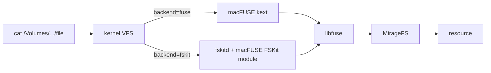

# TypeScript examples

Runnable scripts, one directory per backend or topic. The examples import the
workspace packages from `typescript/`, so rebuild those dists first:

```bash
cd typescript && pnpm --filter @struktoai/mirage-core build && pnpm --filter @struktoai/mirage-node build
cd ../examples/typescript && pnpm install && pnpm exec tsx s3/s3.ts
```

Naming: `<backend>.ts` uses the command surface, `<backend>_fuse.ts` adds a
kernel mount, `<backend>_vfs.ts` stays fully virtual.

## Mount backends: fuse vs fskit

Apple has deprecated third-party kernel extensions; on Apple Silicon the
macFUSE kext already needs a reduced-security boot and admin approval, and
future macOS releases are expected to stop loading it entirely. FSKit
(macOS 15.4+) is Apple's supported userspace replacement, and macFUSE 5.x
serves the same libfuse API through it, so `backend: 'fskit'` keeps real
mounts working on Macs where the kext is blocked.



Same upper half either way; only the kernel-to-userspace hop changes.

Two FUSE rules here: never touch your own mountpoint synchronously (the
mount is served by this process's event loop; probe from a child process,
see `fuse/helper.ts`), and treat fskit as read-mostly and experimental
(`create`/`mkdir`/`rename` return ENOSYS, and one test run wedged on a
write). `fuse/fskit.ts` demonstrates it; details in
`docs/typescript/setup/fuse.mdx`.
