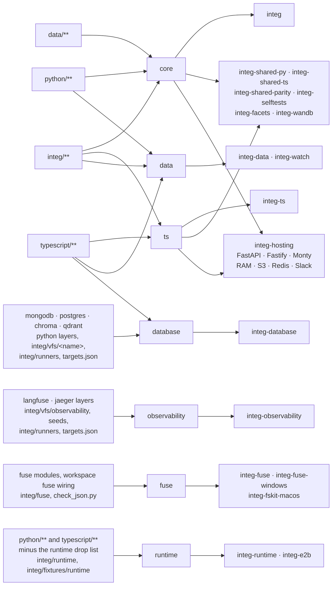

# integ

Cross-host integration tests: one declarative case corpus runs on the python
host and the typescript host against the same targets, so the two
implementations cannot drift apart.

## Pieces

- `runners/`: the battery. Every case is a shell line executed in a mirage
  workspace against a target's mounts; exit code, stdout and stderr are
  compared exactly across hosts and against pinned goldens. A stream that
  is not UTF-8 fails the case, so a case that prints raw bytes pins them
  through `od -An -tx1`.
- `targets.json`: the targets, their mounts, and the env vars each service
  needs.
- `server/`: the fake services. The kit fakes (github, slack, box, dropbox,
  onedrive, gws, mail, gcs, ...) store per run in SQLite through `server/kit/`;
  `server/launcher/main.ts` hosts all of them in one process, one pinned port
  each from `ci/fakes.json`, and announces one `NAME_URL=...` line per arm.
  Some fakes carry a selftest (`pnpm run <name>:selftest`; the list is the
  `*:selftest` scripts in `package.json`); linear and trello have none, and
  the battery is what exercises them.
- `access/`: every way into a workspace (in-app, HTTP, the CLI, MCP over
  HTTP and `mirage mcp`, RPC over HTTP and `mirage rpc`, SSH) under every
  deployment (`dev`, the CLI's own daemon; `token` and `jwt`, the server as a
  service runs it, with a mock Clerk-shaped issuer), on both hosts.
  `cases.json` holds the suites and the ops table (which access has which
  operation, the matrix on `docs/home/access/overview.mdx`); every case pins
  the in-app answer, and every other access must give it. `run.py` also
  checks auth per deployment, the CLI's daemon lifecycle and config, and
  gates that every HTTP route and CLI command was exercised. `inapp.ts` is
  the in-app access on TypeScript.
- `prisma/`: one schema per kit fake.
- `fixtures/`: the seed data cases assume.

## Runs and tenants

A run is an isolated world; a tenant is an account inside it. The runner mints
a fresh run id per target, so parallel batteries against one launcher never
collide.

- HTTP fakes carry the run as a `/_run/<id>/` path prefix, stripped before
  routing; the tenant comes from the credential.
- The mail fake speaks IMAP and SMTP, where no path exists: the username's
  local part is the tenant and the password is the run, so two runs log in at
  one address and see different mail.
- Kit storage is one SQLite file per run under a per-process temp root;
  `POST /reset` seeds or recreates one run.

For unmodified vendor clients that only accept a base URL and credential, opt
into credential routing on the fake process:

```sh
MIRAGE_RUN_TOKEN_PATTERN='^draw:(?<run>[^:]+):(?<tenant>[^:]+)$' \
  pnpm run notion:server
```

Seed with `POST /reset {"run":"a","tenants":["ws"],"fixture":"v1"}`,
then use `Authorization: Bearer draw:a:ws` with the ordinary vendor base URL.
The pattern's named `run` capture is required; `tenant` is optional and keeps
an account/namespace independent of its run. `Authorization: token ...` is
also accepted for run selection. Embedders can set `KitConfig.runTokenPattern`
instead of the environment variable. Without a matching pattern, existing
routing is unchanged. Precedence is path, run header, run query, credential;
explicit tenant headers/queries take precedence over the credential tenant.
Captured names use the same validation as explicit selectors.

GWS accepts the credential in the OAuth `refresh_token` form field and returns
it as the access token, so the subsequent bearer selects the same run. That
credential and the fixture's `gws-integ-token` are the only refresh tokens its
`/token` exchanges; any other gets Google's `400 invalid_grant`. The fixture
token also works as a bearer as it is. An API request with no credential is
refused with 403, and one whose bearer was never exchanged with 401. HF Hub
REST and MCP share run routing and request scheduling.

`DELETE /_kit/runs/<run>` waits for that run's requests, disconnects its client,
deletes its SQLite files and forgets its clocks, counters and remembered
fixture. It is idempotent; a later reset can reuse the name. Other runs are
unaffected. A bare reset remembers the last successful fixture **for that
run**; a new or deleted run starts from the process's `--fixture` choice.
`GET /_kit/health` reports `runs` as a count, never run identifiers.

Stores the fakes do not own are namespaced per run by the runner's adapters
and torn down after: S3 buckets `mirage-integ-<run>-...` (moto in-process by
default), a Mongo database `mirage_integ_<run>`, redis key prefixes, and temp
dirs for ssh.

## What a pull request runs

A push to main runs every job in `.github/workflows/test_integ.yml`. A pull
request runs only the jobs whose path filter matches a changed file; the
filters live in that workflow's `changes` job, and `typescript-build` runs
whenever a job that downloads the built packages does. `integ-ts` and
`integ-shared-ts`, which finish last, build the packages in the job instead
of waiting for it.



The same wiring from the side of a change. Every file under `python/` sets
`core` and `data`, every file under `typescript/` sets `ts`, `data` and
`database`, and every file under `integ/` sets `core`, `ts` and `data`. These
set more:

| Changed                                                                                                      | Also sets               |
| ------------------------------------------------------------------------------------------------------------ | ----------------------- |
| python or typescript source, except the runtime drop list below                                              | runtime                 |
| `integ/runtime/`, `integ/fixtures/runtime/`, `integ/tsconfig.json`                                           | runtime                 |
| `integ/package.json`                                                                                         | runtime, fuse           |
| the python mongodb, postgres, chroma and qdrant layers; their `integ/vfs/` cases                             | database                |
| the langfuse and jaeger layers in either language; `integ/vfs/observability/`; the langfuse and jaeger seeds | observability           |
| `integ/runners/`, `integ/targets.json`                                                                       | database, observability |
| the FUSE modules and the workspace's FUSE wiring in either language; `integ/fuse/`, `integ/check_json.py`    | fuse                    |
| `data/`                                                                                                      | core only               |
| `test_integ.yml`                                                                                             | every filter            |

The runtime drop list is the only subtraction in any filter, and it holds
only what nothing integ-runtime loads can import, directly or not: unit
tests, markdown, the python agent adapters, the browser, dsh and opencode
packages, and the python layers of the backends and account CLIs no runtime
case mounts or runs (the python VFS registry imports a backend only when one
is mounted). A typescript backend stays in, since the core barrel imports
every VFS, and so do FUSE and every command, which the workspace and the
command tables import.

Keep the filters and this section in step with the code: a new or moved
backend, CLI or package belongs in the filter that tests it, a module joins
the drop list only when nothing kept imports it, and a runtime case that
starts mounting a dropped backend takes that name off the list.

`integ-hosting` runs `hosting/cases.json` against real FastAPI and Fastify
listeners in child processes. It checks parallel foreground HTTP requests,
same-session queueing, independent sessions and workspaces, health responses,
HTTP GET/form POST/wget, busy shell loops, cancellation before trailing writes,
and snapshot round trips. The HTTP backend is held behind an explicit release
gate, so another request must finish while the first is still active; a sleep
duration or throughput estimate is not the assertion. The normal `python/**`,
`typescript/**` and `integ/**` filters cover both the execution packages and this
suite. Run it locally with `cd integ && pnpm exec tsx hosting/run.ts` after
building TypeScript; append `python` or `typescript` to select one host.

CI also passes `--mounts` to run `hosting/monty.json` on both hosts. Every
scenario creates two workspaces with explicit Monty runtimes and RAM, S3,
Redis and Slack mounts. One Monty call waits on a gated Slack read or spins
in a CPU loop while another session and workspace read Slack and read/write
all three storage mounts. The assertions cover session queueing, queued and
running cancellation, recovery with a fresh Monty call, isolated workspace
storage, and completed shutdown. Redis is a real service container, S3 is
MinIO, and Slack uses the existing Web API fixture; no real Slack credentials
are needed. Redis here is a VFS mount, not execution tracking.

For this expanded run, install Python's `monty`, `s3` and `redis` extras,
generate the Slack Prisma client (`pnpm exec prisma generate --schema prisma/slack.prisma` from `integ`, with `INTEG_DB_URL=file:/tmp/hosting.db`),
and provide disposable services through `S3_ENDPOINT`, `REDIS_URL`,
`AWS_ACCESS_KEY_ID` and `AWS_SECRET_ACCESS_KEY`. Run `pnpm exec tsx hosting/run.ts --mounts`. Missing services or Monty fail the run; the suite
does not silently skip them. Each run uses a unique S3 bucket and Redis key
prefix; the bucket and Slack fixture are cleaned up, while Redis keys are
discarded with the service container.

The `command-service` core target exercises ordinary VFS command registration
with a backend that refuses dispatcher byte reads. Search must reach its
registered `grep`/`rg` handlers, including filters, depth, sorting and links.
The target combines nested service mounts, a regular RAM mount, a child that
serves metadata without search commands, and hidden descendants.
`crossmount/grep/native.json` also covers repeated operands, quiet stopping,
errors, an existing custom aggregate registration, and one CLI invocation
through dispatch doors. A barrier proves native read preparation is bounded to
four invocations; stream cases check partial failures, timeout cleanup and early
pipe closure. Mutation commands and shared stdin retain serial execution.
The program cases cover automatically wired generics and output paths across
mounts, including compression, truncation and splitting. Both core shards
discover this target from the manifest; the shared parity job also compares it
and `ram-nested`. The existing `python/**`, `typescript/**`, and `integ/**`
filters cover these modules and cases.

## Running locally

The `unix/cp` and `unix/mv` cases use GNU coreutils 9.7 as their transfer
reference (`debian:stable-slim`, `LC_ALL=C LANG=C TZ=UTC`). In particular,
`--update` accepts and advertises `all`, `none`, `none-fail`, and `older`;
the three-candidate diagnostic from 9.4 is no longer the reference.
The remeasurement used image
`debian@sha256:04634311a8d5fc442b6eb06d792293c4f3e2268652ca7634e00ce8ef5cc0a28a`.
One existing environment difference remains: for a missing exchange target,
this image reports `Unknown error -1`; the `mv_exchange_missing_side` golden
retains `No such file or directory`.

```bash
cd integ && npx tsx server/launcher/main.ts --config ci/fakes.json
# export the NAME_URL lines it prints, then:
./python/.venv/bin/python integ/runners/python/main.py --facet core --strict \
  --allow-skip chroma,lancedb,nextcloud,notion,postgres,qdrant
```

The core facet also needs redis and mongo on their default ports (CI uses a
`mongo:8` service container; `docker run -d -p 27017:27017 mongo:8` matches
it) and `MIRAGE_QUICKJS_HOME` pointing at the quickjs-ng WASI build for the
scripted target. If a pinned port is taken locally, copy `ci/fakes.json` and
move that one entry.
