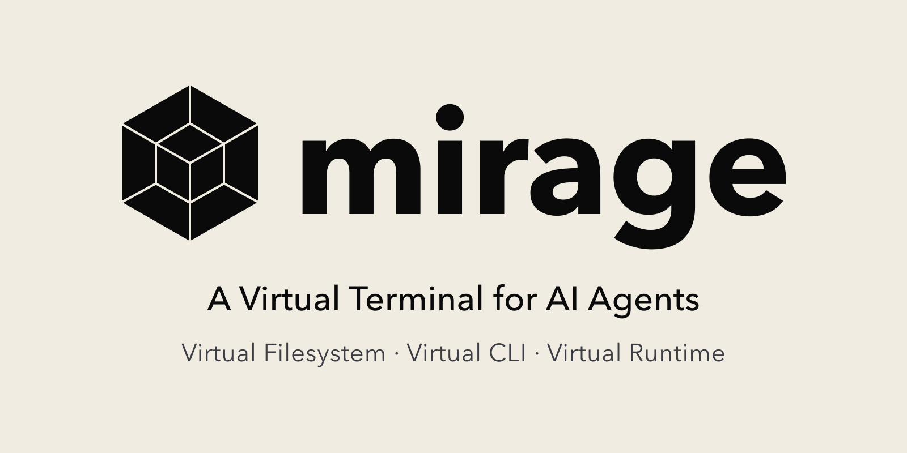
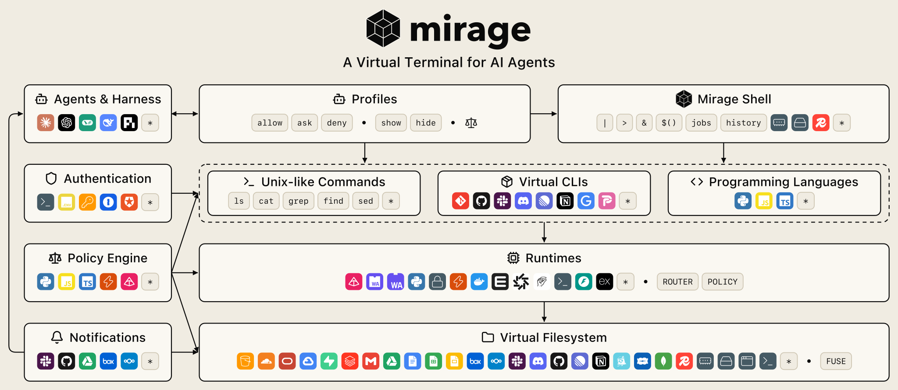

<p align="center">
  <picture>
    <source media="(prefers-color-scheme: dark)" srcset="../assets/mirage-og-dark@2x.png">
    
  </picture>
</p>

<p align="center">
    <a href="https://docs.mirage.strukto.ai" alt="Tài liệu">
        </a>
    <a href="https://www.strukto.ai" alt="Trang web">
        </a>
    <a href="https://github.com/strukto-ai/mirage/blob/main/LICENSE" alt="Giấy phép">
        </a>
    <a href="https://discord.gg/u8BPQ65KsS" alt="Cộng đồng Discord">
        </a>
    <br/>
    <a href="https://docs.mirage.strukto.ai/python/quickstart" alt="Tài liệu Python">
        </a>
    <a href="https://pypi.org/project/mirage-ai/" alt="Phiên bản PyPI">
        </a>
    <br/>
    <a href="https://docs.mirage.strukto.ai/typescript/quickstart" alt="Tài liệu TypeScript">
        </a>
    <a href="https://www.npmjs.com/package/@struktoai/mirage-node" alt="Phiên bản NPM">
        </a>
</p>

<p align="center">
  <a href="../README.md"></a>
  <a href="./README.zh-CN.md"></a>
  <a href="./README.zh-TW.md"></a>
  <a href="./README.fr.md"></a>
  <a href="./README.de.md"></a>
  <a href="./README.vi.md"></a>
  <a href="./README.ko.md"></a>
</p>

Mirage là **terminal ảo cho AI Agent**. Hệ thống tệp ảo mang lại ngữ cảnh dữ liệu rộng, các CLI ảo hóa cho agent linh hoạt hơn khi dùng công cụ, runtime động giảm chi phí hạ tầng bên dưới và tiết kiệm token hơn, còn quyền kiểm soát chi tiết đối với hành động của agent và cả những gì nó nhìn thấy mang lại độ an toàn tốt nhất. Cùng nhau, các phần này tạo thành một terminal ảo hóa duy nhất, đem lại hiệu năng agent, hiệu quả chi phí và bảo mật tốt nhất.

```python
ws = Workspace(
    {
        "/tmp":   (RAMResource(), MountMode.EXEC),
        "/redis": (RedisResource(url=redis_url), MountMode.WRITE),
        "/slack": (SlackResource(SlackConfig(token=slack_bot_token)), MountMode.EXEC),
    },
    # monty bắt python, nên script chạy trong sandbox bên trong workspace
    runtimes=[MontyRuntime(captures=["python", "python3"]), "vfs"],
)

# một lệnh grep quét mọi nguồn
await ws.execute("grep -rln session /redis /tmp")

# chạy script nằm trong Slack, ghi báo cáo vào Redis
await ws.execute("python3 /slack/channels/general_.../files/example__F....py > /redis/report.txt")

# cài một CLI có kiểu dưới một từ khóa: điều phối theo tên, không theo đường dẫn,
# và có thể khám phá qua `man`, `type`, `which` như mọi chương trình khác
ws.register_cli("slack", SLACK, {"token": slack_bot_token})
await ws.execute('slack send-message --channel general --text "report is up"')
```

## Giới thiệu

- **Một giao diện terminal ảo thống nhất, thay vì N SDK và M MCP.** Mọi backend đều dùng cùng một ngữ nghĩa hệ thống tệp, nên pipeline kết hợp được giữa các dịch vụ.
- **Hệ thống tệp ảo trên mọi nguồn dữ liệu.** S3, Google Drive, Slack, Gmail, Redis và các nguồn khác được gắn cạnh nhau dưới một gốc duy nhất, nên agent tiếp cận tất cả qua một giao diện thống nhất bằng các công cụ unix nó đã biết như `ls`, `grep`, `find` và `jq`.
- **Công cụ dòng lệnh ảo (CLI).** `git`, `slack` và `ntn` do chính Mirage đáp ứng, nên agent điều khiển dịch vụ mà không cần cài gì, xuyên qua các runtime và máy khác nhau; một công cụ còn có thể ảo hóa thành hai hoặc nhiều hơn, mỗi cái mang tên riêng với thông tin xác thực riêng.
- **Runtime động, có định tuyến.** Python, JavaScript và bất kỳ lệnh nào khác đều có thể được gửi tới runtime đã cấu hình, trong tiến trình, trong sandbox hoặc từ xa, tách tính toán khỏi lưu trữ và cho phép đổi bên này mà không động tới bên kia.
- **Mirage shell ảo hóa.** Nó gắn hệ thống tệp, các CLI và các runtime vào cùng một dòng lệnh, nên pipe, chuyển hướng, biến, job và lịch sử đều hoạt động xuyên cả ba.
- **Profile thiết kế cho agent.** `allow`, `ask` và `deny` chi phối lệnh và CLI, còn `hide` và `show` chi phối tệp và thư mục, nên một đường dẫn bị ẩn không chỉ là không đọc được mà còn không tồn tại trong hệ thống tệp mà agent nhìn thấy.
- **Công cụ chính sách viết được bằng script.** Một script chính sách có thể chặn mọi hành động nguy hiểm trước khi nó chạy, và cùng ngăn xếp đó kiểm soát mọi thao tác VFS và mọi lần ghi session, nên không tệp nào và không biến môi trường nào bị rò rỉ.
- **Thông báo nối vào VFS và agent.** Thay đổi bên ngoài trở thành luồng sự kiện trên mount, nên một trả lời Slack mới hiện ra như một thay đổi của tệp hội thoại trong hệ thống tệp ảo, và agent phản ứng theo đó thay vì quét lại toàn bộ cây.

## Kiến trúc

<p align="center">
  <picture>
    <source media="(prefers-color-scheme: dark)" srcset="../assets/mirage-arch-dark.svg">
    
  </picture>
</p>

## Cài đặt

- **Python** ≥ 3.11 cho gói `mirage-ai` và CLI `mirage`
- **Node.js** ≥ 20 cho SDK TypeScript
- **macOS** hoặc **Linux** (mount dựa trên FUSE cần nền tảng hỗ trợ)

### Python

```bash
uv add mirage-ai    # cài thư viện `mirage` và binary CLI `mirage`
```

### TypeScript

```bash
npm install @struktoai/mirage-node      # máy chủ Node.js và CLI
npm install @struktoai/mirage-browser   # trình duyệt / edge runtime
npm install @struktoai/mirage-agents    # adapter OpenAI / Vercel AI / LangChain / Mastra
```

Cả hai gói runtime đều tự động kéo theo `@struktoai/mirage-core`.

### CLI

```bash
curl -fsSL https://strukto.ai/mirage/install.sh | sh
# hoặc
npm install -g @struktoai/mirage-cli
# hoặc
uvx mirage-ai
# hoặc
npx @struktoai/mirage-cli
```

## Bắt đầu nhanh

### Python

```python
from mirage import Workspace
from mirage.resource.ram import RAMResource
from mirage.resource.s3 import S3Config, S3Resource

ws = Workspace({
    "/data": RAMResource(),
    "/s3":   S3Resource(S3Config(bucket="my-bucket")),
})

await ws.execute("cp /s3/report.csv /data/report.csv")
await ws.execute("grep alert /s3/data/log.jsonl | wc -l")

await ws.snapshot("demo.tar")
```

### TypeScript

```ts
import { Workspace, RAMResource, S3Resource } from '@struktoai/mirage-node'

const ws = new Workspace({
  '/data': new RAMResource(),
  '/s3':   new S3Resource({ bucket: 'my-bucket' }),
})

await ws.execute('cp /s3/report.csv /data/report.csv')
await ws.execute('grep alert /s3/data/log.jsonl | wc -l')

await ws.snapshot('demo.tar')
```

### CLI

```bash
mirage workspace create ws.yaml --id demo
mirage execute   --workspace_id demo --command "cp /s3/report.csv /data/report.csv"
mirage provision --workspace_id demo --command "cat /s3/data/large.jsonl"
mirage workspace snapshot demo demo.tar
mirage workspace load demo.tar --id demo-restored
```

## Framework agent

Mirage cắm vào các framework agent như một lớp sandbox hoặc công cụ. Các thao tác POSIX như `read` cũng có thể tùy biến theo tài nguyên và loại tệp: Mirage không đi kèm bộ render định dạng nào, nên một định dạng hiển thị đúng theo cách bạn đăng ký, và lệnh đăng ký cho một tài nguyên và phần mở rộng cụ thể sẽ thắng lệnh chung.

|              | Tích hợp                                                                                                                                                                                                                                                                                                                                                                                                                        |
| ------------ | ------------------------------------------------------------------------------------------------------------------------------------------------------------------------------------------------------------------------------------------------------------------------------------------------------------------------------------------------------------------------------------------------------------------------------- |
| Python       | [OpenAI Agents SDK](https://docs.mirage.strukto.ai/python/agents/openai-agents), [LangChain](https://docs.mirage.strukto.ai/python/agents/langchain), [Pydantic AI](https://docs.mirage.strukto.ai/python/agents/pydantic-ai), [CAMEL](https://docs.mirage.strukto.ai/python/agents/camel), [OpenHands](https://docs.mirage.strukto.ai/python/agents/openhands), [Agno](https://docs.mirage.strukto.ai/python/agents/agno)      |
| TypeScript   | [Vercel AI SDK](https://docs.mirage.strukto.ai/typescript/agents/vercel), [OpenAI Agents SDK](https://docs.mirage.strukto.ai/typescript/agents/openai), [LangChain](https://docs.mirage.strukto.ai/typescript/agents/langchain), [Mastra](https://docs.mirage.strukto.ai/typescript/agents/mastra)                                                                                                                              |
| Coding agent | [Claude Code](https://docs.mirage.strukto.ai/python/agents/claude-code), [Codex](https://docs.mirage.strukto.ai/typescript/agents/codex), [DeepSeek Harness](https://docs.mirage.strukto.ai/typescript/agents/dsh), [Grok Build](https://docs.mirage.strukto.ai/typescript/agents/grok-build), [OpenCode](https://docs.mirage.strukto.ai/typescript/agents/opencode), [Pi](https://docs.mirage.strukto.ai/typescript/agents/pi) |

## Bộ nhớ đệm

Mỗi `Workspace` có bộ nhớ đệm hai tầng, để công việc lặp lại trên các backend từ xa dùng trạng thái cục bộ thay vì mạng:

- **Cache chỉ mục:** danh sách thư mục và metadata. Lần duyệt thư mục đầu tiên gọi API; các lần sau đọc từ chỉ mục cho đến khi TTL hết hạn (mặc định 10 phút).
- **Cache tệp:** byte của đối tượng. Lần đọc đầu tiên stream từ nguồn; các pipeline sau đọc từ cache (mặc định 512 MB).

Cả hai tầng mặc định dùng RAM trong tiến trình, không cần cấu hình. Store Redis chia sẻ trạng thái cache giữa các worker, tiến trình và máy:

```ts
import { RedisFileCacheStore, S3Resource, Workspace } from '@struktoai/mirage-node'

const ws = new Workspace(
  { '/s3': new S3Resource({ bucket: 'my-bucket' }) },
  {
    cache: new RedisFileCacheStore({ url: 'redis://localhost:6379/0', cacheLimit: '8GB' }),
    index: { type: 'redis', url: 'redis://localhost:6379/0', ttl: 600 },
  },
)
```

Xem [tài liệu cache](https://docs.mirage.strukto.ai/home/cache) để biết vòng đời miss/hit đầy đủ.

## Người đóng góp

Cảm ơn tất cả những người đã đóng góp cho Mirage.

<a href="https://github.com/strukto-ai/mirage/graphs/contributors">
  
</a>
